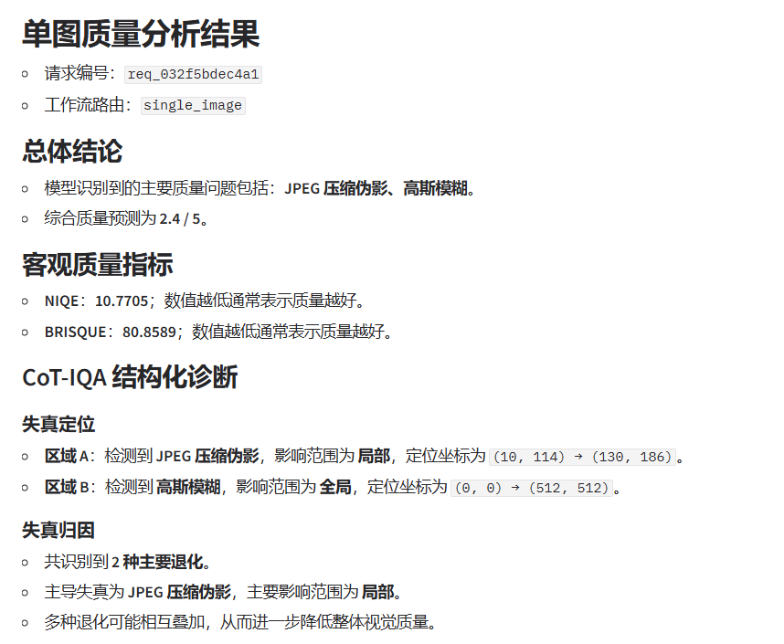
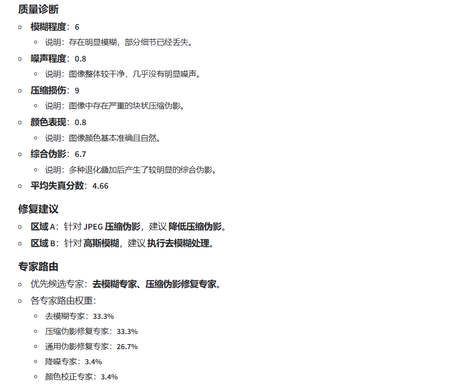
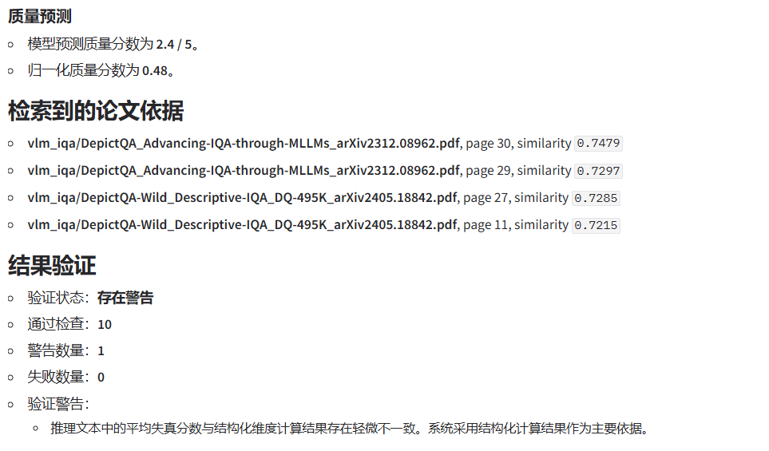
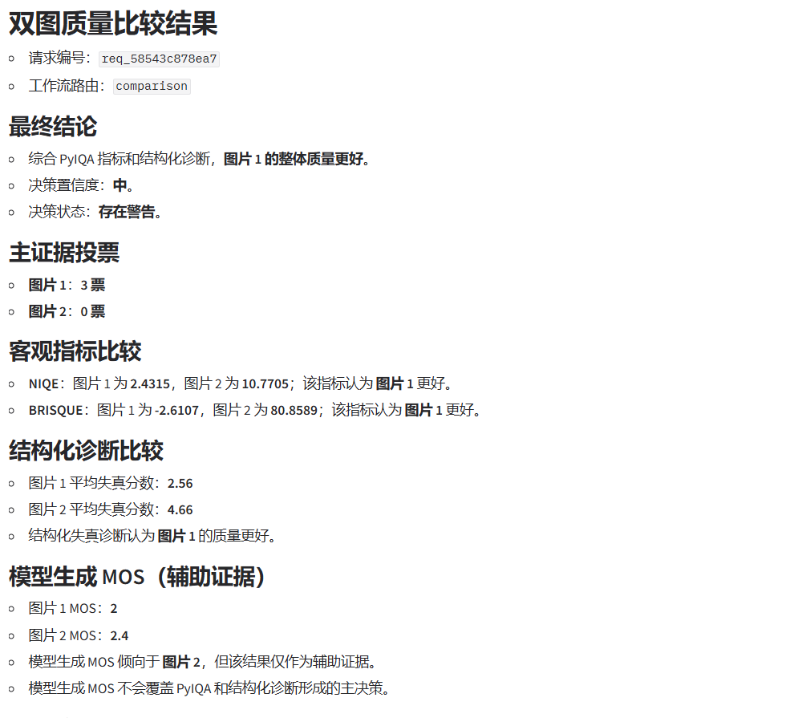
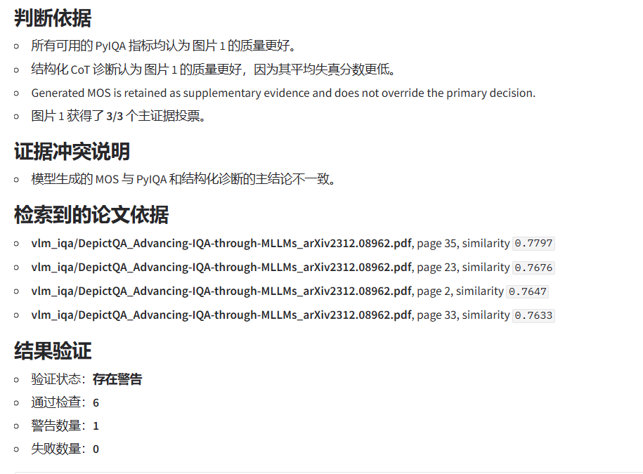
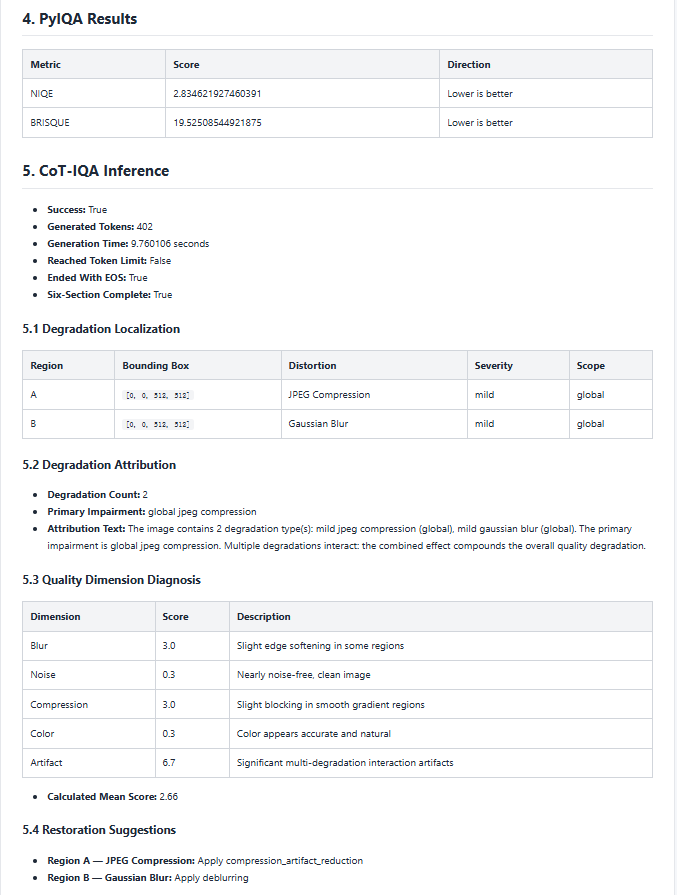
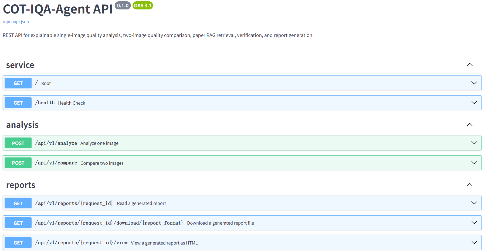
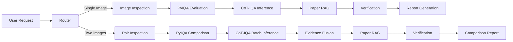

# COT-IQA-Agent

COT-IQA-Agent 是一个面向图像质量评估的多模态 Agent 工程项目。

系统将本地 CoT-IQA 多模态模型、PyIQA 客观指标、LangGraph 工作流、论文 RAG、结果验证与报告生成整合为统一应用，支持单图质量分析和双图质量比较，并提供 Gradio 网页界面与 FastAPI REST 接口。

---

## 1. 项目定位

本项目基于 CoT-IQA 图像质量评价研究构建，目标不是简单封装模型推理，而是形成一套完整、可演示、可测试、可扩展的多模态 Agent 工程系统。

项目主要面向以下场景：

- AI 大模型应用开发项目展示
- Agent 算法工程师实习与面试
- 多模态模型工程实践
- 图像质量评价研究系统化落地
- GitHub 项目公开展示
- 本地 GPU 服务器部署与演示

---

## 2. 核心能力

### 2.1 单图质量分析

输入一张图片后，系统可以自动完成：

- 图像文件有效性检查
- 图像尺寸、通道与基础元数据读取
- 亮度、对比度、熵、饱和度和边缘强度统计
- NIQE 无参考质量评估
- BRISQUE 无参考质量评估
- 失真区域定位
- 失真类型识别
- 失真严重程度分析
- 多维质量诊断
- 修复建议生成
- 图像修复专家路由
- MOS 质量分数预测
- IQA 论文知识检索
- 结果一致性验证
- JSON 报告生成
- Markdown 报告生成
- HTML 报告展示

### 2.2 双图质量比较

输入两张图片后，系统可以自动完成：

- 两张图片的独立质量检查
- 两张图片的 NIQE 比较
- 两张图片的 BRISQUE 比较
- 两张图片的 CoT-IQA 结构化诊断
- 结构化失真均值比较
- 多证据投票
- 最终质量优胜图判断
- 模型生成 MOS 冲突检测
- 论文依据检索
- 比较结果一致性验证
- JSON、Markdown 和 HTML 比较报告生成

系统将以下证据作为主要决策来源：

1. NIQE 指标
2. BRISQUE 指标
3. CoT-IQA 结构化诊断分数

模型生成 MOS 作为辅助证据保留，不会直接覆盖主证据的最终判断。

---

## 3. Demo

### Single-Image Quality Analysis

单图分析模块联合 PyIQA、CoT-IQA 与论文 RAG，对输入图像执行客观质量评估、失真定位与归因、多维质量诊断、修复建议、专家路由和结果验证。

<p align="center">
  
</p>

<p align="center">
  
</p>

<p align="center">
  
</p>

### Two-Image Quality Comparison

双图比较模块综合 PyIQA 客观指标、CoT-IQA 结构化诊断和辅助 MOS 证据，通过多证据融合输出最终质量判断，并显式展示证据投票、冲突分析、论文依据与验证结果。

<p align="center">
  
</p>

<p align="center">
  
</p>

### Structured IQA Report

系统可生成结构化 HTML 分析报告，集中展示 PyIQA 客观指标、CoT-IQA 推理结果、失真诊断与针对性的修复建议。

<p align="center">
  
</p>

### FastAPI / Swagger

系统同时提供 REST API，包括健康检查、单图分析、双图比较、报告查询、HTML 报告查看以及 JSON / Markdown 报告下载。

<p align="center">
  
</p>

---

## 4. 系统架构




系统采用 LangGraph 对工作流进行编排。

根据用户上传图片数量和请求意图，Router 会选择以下路径：

- `single_image`
- `comparison`
- `reject`

---

## 5. 技术栈

| 模块 | 技术 |
|---|---|
| 多模态基础模型 | Qwen2-VL-7B-Instruct |
| 参数高效微调 | LoRA / PEFT |
| Agent 编排 | LangGraph |
| 客观 IQA | PyIQA |
| IQA 指标 | NIQE、BRISQUE |
| 结构化解析 | 自定义 CoT-IQA Parser |
| RAG Embedding | BAAI/bge-m3 |
| 向量数据库 | FAISS |
| PDF 解析 | PyMuPDF、pypdf |
| Web UI | Gradio |
| REST API | FastAPI |
| ASGI Server | Uvicorn |
| 数据验证 | Pydantic |
| 自动化测试 | pytest |
| 深度学习框架 | PyTorch |
| 多模态推理框架 | Transformers |

---

## 6. CoT-IQA 推理结构

CoT-IQA 的结构化推理链由六个阶段构成。

### 5.1 Localization

定位图像中的主要失真区域，包括：

- 区域名称
- 边界框
- 影响范围
- 失真类型
- 严重程度

### 5.2 Attribution

识别图像质量退化的主要原因，包括：

- 主要失真
- 次要失真
- 失真数量
- 失真影响范围
- 失真之间的交互关系

### 5.3 Diagnosis

从多个质量维度进行结构化分析，例如：

- 清晰度
- 噪声
- 压缩伪影
- 颜色
- 对比度
- 亮度
- 综合伪影
- 多失真交互

### 5.4 Restoration Suggestion

根据识别到的失真生成针对性修复建议，例如：

- 去模糊
- 降噪
- JPEG 压缩伪影修复
- 亮度校正
- 对比度增强
- 色彩校正
- 边缘恢复

### 5.5 Expert Routing

系统根据失真类型和诊断结果选择对应专家，例如：

- Deblur Expert
- Denoise Expert
- Compression Artifact Expert
- Color Correction Expert
- Contrast Enhancement Expert
- General Artifact Expert

### 5.6 Quality Prediction

模型最终输出：

- 预测 MOS
- MOS 量表
- 归一化 MOS
- 预测置信度

Parser 会对以下内容执行校验：

- 六阶段结构是否完整
- 边界框是否合法
- 严重度字段是否合法
- 专家权重是否有效
- MOS 是否处于合理范围
- 必填字段是否缺失

---

## 7. Agent 工作流

### 6.1 单图工作流

```text
Request
  ↓
Router
  ↓
Image Inspection
  ↓
PyIQA Evaluation
  ↓
CoT-IQA Inference
  ↓
Paper RAG Retrieval
  ↓
Result Verification
  ↓
Report Generation
```

### 6.2 双图工作流

```text
Request
  ↓
Router
  ↓
Pair Image Inspection
  ↓
PyIQA Comparison
  ↓
CoT-IQA Batch Inference
  ↓
Multi-Evidence Comparison
  ↓
Paper RAG Retrieval
  ↓
Comparison Verification
  ↓
Comparison Report Generation
```

### 6.3 失败隔离

系统对以下模块进行了失败隔离：

- 图像读取失败
- PyIQA 指标失败
- 模型加载失败
- CoT-IQA 推理失败
- Parser 解析失败
- RAG 检索失败
- 报告写入失败

单个辅助模块失败时，错误会记录到 Agent State 中，避免无提示退出。

---

## 8. 多证据双图决策

双图质量比较不直接依赖单一模型分数。

当前主证据包括：

- NIQE 一票
- BRISQUE 一票
- 结构化诊断均值一票

每项证据分别判断：

- `image_1`
- `image_2`
- 平局或无效

最终根据可信投票数量决定优胜图。

### 7.1 MOS 的处理方式

模型生成 MOS 可能受到生成稳定性和标定误差影响，因此：

- MOS 不作为主证据投票
- MOS 仅作为辅助解释
- MOS 与主证据冲突时记录到 `conflicts`
- MOS 相同时不参与区分

### 7.2 置信度

比较结果会输出：

- `high`
- `medium`
- `low`

置信度由主证据一致性、投票差距和辅助证据冲突共同决定。

---

## 9. 论文 RAG

系统支持将 IQA 相关论文构建为本地知识库。

RAG 主要用于：

- 为失真诊断提供研究依据
- 检索相似 IQA 方法
- 检索多模态 IQA 工作
- 检索因果 IQA 工作
- 检索 Agent 型质量评价研究
- 为最终报告提供论文来源

当前技术方案：

- PDF 解析：PyMuPDF
- PDF 备用解析：pypdf
- Embedding：BAAI/bge-m3
- 向量索引：FAISS IndexFlatIP
- 向量归一化：开启
- 在线检索设备：CPU
- 默认 Top-K：4
- 页面级去重：开启

在线检索使用 CPU，避免 BGE-M3 和 Qwen2-VL 同时占用 GPU 显存。

建库阶段可以使用 CUDA。

---

## 10. 项目结构

```text
COT-IQA-Agent/
├── app.py
├── README.md
├── requirements.txt
├── requirements-model.txt
├── requirements-dev.txt
├── pytest.ini
├── .env.example
├── .gitignore
│
├── agent/
│   ├── __init__.py
│   ├── state.py
│   ├── router.py
│   ├── graph.py
│   ├── nodes.py
│   ├── verification.py
│   ├── reporting.py
│   ├── comparison.py
│   ├── comparison_verification.py
│   └── comparison_reporting.py
│
├── models/
│   ├── __init__.py
│   ├── cot_iqa_model.py
│   └── parser.py
│
├── tools/
│   ├── __init__.py
│   ├── image_tools.py
│   └── pyiqa_tools.py
│
├── rag/
│   ├── __init__.py
│   ├── build_index.py
│   ├── retriever.py
│   └── vector_store/
│
├── ui/
│   ├── __init__.py
│   └── gradio_app.py
│
├── configs/
│   ├── __init__.py
│   ├── config.yaml
│   └── config_loader.py
│
├── assets/
│   ├── papers/
│   └── test_images/
│
├── outputs/
│   ├── reports/
│   └── logs/
│
├── scripts/
│   ├── start_gradio.sh
│   ├── start_api.sh
│   ├── check_project.sh
│   ├── smoke_test_cot_iqa.py
│   └── wait_then_smoke_test.sh
│
└── tests/
    ├── conftest.py
    ├── test_api_contract.py
    ├── test_report_api.py
    ├── test_rag_node.py
    └── test_ui_formatting.py
```

---

## 11. 环境要求

当前验证环境：

- Ubuntu / Linux Server
- Python 3.11.15
- NVIDIA RTX 4090 24 GB
- PyTorch 2.12.0
- CUDA Runtime 13.0
- Torchvision 0.27.0
- Transformers 5.6.0
- PyIQA 0.1.16
- Sentence Transformers 5.6.1
- FAISS 1.15.0
- Gradio 5.50.0
- FastAPI 0.136.3
- LangGraph 1.2.10

其他 NVIDIA GPU 也可以运行，但显存需求取决于：

- 基础模型大小
- 模型精度
- 是否使用量化
- 输入图像尺寸
- 最大生成长度
- 是否同时运行 Embedding 模型

---

## 12. 安装

### 11.1 克隆项目

```bash
git clone <your-repository-url>
cd COT-IQA-Agent
```

### 11.2 创建 Conda 环境

```bash
conda create -n cotagent python=3.11 -y
conda activate cotagent
```

### 11.3 安装应用依赖

```bash
pip install -r requirements.txt
```

### 11.4 安装模型运行依赖

```bash
pip install -r requirements-model.txt
```

### 11.5 安装测试依赖

```bash
pip install -r requirements-dev.txt
```

---

## 13. 环境变量配置

复制环境变量模板：

```bash
cp .env.example .env
```

编辑 `.env`：

```dotenv
# LLM API configuration
LLM_PROVIDER=
LLM_MODEL=
LLM_API_KEY=
LLM_BASE_URL=

# Embedding model
EMBEDDING_MODEL=BAAI/bge-m3

# CoT-IQA model
COT_IQA_BASE_MODEL_PATH=/path/to/Qwen2-VL-7B-Instruct
COT_IQA_ADAPTER_PATH=/path/to/cot-iqa-lora-adapter

# Project directories
PAPER_DIR=assets/papers
VECTOR_STORE_DIR=rag/vector_store
REPORT_DIR=outputs/reports
LOG_DIR=outputs/logs
```

基础模型目录需要包含：

```text
config.json
```

LoRA Adapter 目录需要包含：

```text
adapter_config.json
adapter_model.safetensors
```

`LLM_PROVIDER`、`LLM_MODEL`、`LLM_API_KEY` 和 `LLM_BASE_URL` 是外部 LLM 扩展预留字段。

当前本地 CoT-IQA 核心工作流不依赖外部 API。

---

## 14. 项目配置

主配置文件：

```text
configs/config.yaml
```

主要配置模块：

```yaml
project:
  name: COT-IQA-Agent
  version: 0.1.0
  environment: development
```

```yaml
cot_iqa:
  base_model_path: ${COT_IQA_BASE_MODEL_PATH}
  adapter_path: ${COT_IQA_ADAPTER_PATH}
  device: auto
  dtype: bfloat16
  max_new_tokens: 1024
```

```yaml
pyiqa:
  enabled: true
  device: auto
  metrics:
    - niqe
    - brisque
```

```yaml
rag:
  enabled: true
  embedding_model: ${EMBEDDING_MODEL}
  chunk_size: 800
  chunk_overlap: 120
  top_k: 4
  normalize_embeddings: true
  runtime_device: cpu
```

---

## 15. 准备模型

本项目不会在 Git 仓库中提交模型权重。

使用者需要自行准备：

1. Qwen2-VL-7B-Instruct 基础模型
2. CoT-IQA LoRA Adapter
3. BAAI/bge-m3 Embedding 模型

模型路径通过 `.env` 指定。

示例：

```dotenv
COT_IQA_BASE_MODEL_PATH=/home/user/models/Qwen2-VL-7B-Instruct
COT_IQA_ADAPTER_PATH=/home/user/checkpoints/cot-iqa/checkpoint-216
```

---

## 16. 构建论文 RAG

### 15.1 放置论文

将合法获取的 IQA 论文 PDF 放入：

```text
assets/papers/
```

推荐按主题建立目录：

```text
assets/papers/
├── vlm_iqa/
├── causal_iqa/
└── agent_iqa/
```

### 15.2 构建索引

```bash
python rag/build_index.py \
  --device cuda \
  --batch-size 4 \
  --force
```

首次建库时会执行：

1. 递归扫描 PDF
2. 提取 PDF 文本
3. 文本切块
4. 计算 SHA 标识
5. 使用 BGE-M3 编码
6. 向量归一化
7. 构建 FAISS 索引
8. 原子写入索引文件
9. 保存 Manifest
10. 保存 Chunk Metadata

### 15.3 Hugging Face 镜像

服务器无法直接访问 Hugging Face 时，可以配置镜像：

```bash
export HF_ENDPOINT=https://hf-mirror.com
export HF_HUB_ETAG_TIMEOUT=60
export HF_HUB_DOWNLOAD_TIMEOUT=300
export HF_HUB_DISABLE_XET=1
```

然后重新建库：

```bash
python rag/build_index.py \
  --device cuda \
  --batch-size 4 \
  --force
```

### 15.4 增量重建

去掉 `--force` 后，未修改的论文会复用已有文本块与向量：

```bash
python rag/build_index.py \
  --device cuda \
  --batch-size 4
```

### 15.5 当前开发数据

开发环境曾使用：

- 16 篇 IQA 论文
- 2078 个文本块
- 1024 维向量
- FAISS IndexFlatIP

论文 PDF 和生成的向量索引不会包含在公开仓库中。

---

## 17. 项目检查

运行：

```bash
./scripts/check_project.sh
```

检查内容包括：

- Python 版本
- PyTorch 版本
- CUDA 可用性
- GPU 型号
- 基础模型目录
- LoRA Adapter 目录
- RAG 向量索引
- RAG 在线设备配置
- Python 语法
- FastAPI 健康状态

通过后会显示：

```text
COT-IQA-Agent project check: PASSED
```

---

## 18. 启动 Gradio

运行：

```bash
conda activate cotagent
./scripts/start_gradio.sh
```

默认地址：

```text
http://localhost:7860
```

Gradio 页面包含两个功能标签：

### 单图质量分析

支持：

- 图片上传
- 自定义分析要求
- PyIQA 指标展示
- 中文结构化诊断
- 修复建议
- 专家路由
- MOS 展示
- RAG 论文依据
- 验证摘要
- 完整 JSON

### 双图质量比较

支持：

- 两张图片上传
- 质量优胜图判断
- 多证据投票
- NIQE 和 BRISQUE 比较
- 结构化失真分数比较
- MOS 冲突说明
- RAG 论文依据
- 验证摘要
- 完整 JSON

### Gradio 运行规则

当前 Gradio 使用共享推理队列，默认限制并发为 1。

这是为了避免单张 RTX 4090 同时加载多个模型推理请求导致显存不足。

---

## 19. 启动 FastAPI

运行：

```bash
conda activate cotagent
./scripts/start_api.sh
```

默认服务地址：

```text
http://localhost:8000
```

Swagger：

```text
http://localhost:8000/docs
```

ReDoc：

```text
http://localhost:8000/redoc
```

FastAPI 同样使用共享推理锁，单 GPU 请求默认串行执行。

---

## 20. REST API

### 19.1 服务信息

```http
GET /
```

### 19.2 健康检查

```http
GET /health
```

健康检查包含：

- CUDA 是否可用
- GPU 名称
- 基础模型是否配置
- LoRA Adapter 是否配置
- RAG 索引是否存在
- 报告目录是否可写

### 19.3 单图分析

```http
POST /api/v1/analyze
```

请求类型：

```text
multipart/form-data
```

参数：

| 参数 | 类型 | 必填 | 说明 |
|---|---|---:|---|
| image | File | 是 | 待分析图片 |
| query | String | 否 | 自定义分析要求 |

curl 示例：

```bash
curl -X POST \
  http://localhost:8000/api/v1/analyze \
  -F "image=@assets/test_images/real_test.png" \
  -F "query=分析图像质量并给出修复建议"
```

### 19.4 双图比较

```http
POST /api/v1/compare
```

参数：

| 参数 | 类型 | 必填 | 说明 |
|---|---|---:|---|
| image_1 | File | 是 | 第一张图片 |
| image_2 | File | 是 | 第二张图片 |
| query | String | 否 | 自定义比较要求 |

curl 示例：

```bash
curl -X POST \
  http://localhost:8000/api/v1/compare \
  -F "image_1=@assets/test_images/real_test.png" \
  -F "image_2=@assets/test_images/blur_test.png" \
  -F "query=比较两张图片并判断哪张质量更好"
```

### 19.5 查询完整报告

```http
GET /api/v1/reports/{request_id}
```

该接口返回：

- JSON 报告
- Markdown 报告
- 报告类型
- 报告文件信息
- 下载地址

该接口主要供程序读取。

### 19.6 浏览 HTML 报告

```http
GET /api/v1/reports/{request_id}/view
```

该接口将 Markdown 报告渲染为人类可读的 HTML 页面。

示例：

```text
http://localhost:8000/api/v1/reports/req_xxxxxxxxxxxx/view
```

### 19.7 下载 JSON 报告

```http
GET /api/v1/reports/{request_id}/download/json
```

### 19.8 下载 Markdown 报告

```http
GET /api/v1/reports/{request_id}/download/markdown
```

---

## 21. API 返回设计

单图和双图接口默认返回精简结构，避免 Swagger 和客户端接收过大的响应体。

默认响应包括：

- `status`
- `request_id`
- `route`
- `summary`
- `verification`
- `rag_sources`
- `report_urls`
- `execution_trace`
- `errors`

### 20.1 单图精简结果

单图 `summary` 主要包括：

- PyIQA 指标
- 主要失真
- 失真区域
- 诊断均值
- 预测 MOS
- MOS 量表
- 归一化 MOS
- 选择的专家
- 专家权重
- 修复建议

### 20.2 双图精简结果

双图 `summary` 主要包括：

- 优胜图片
- 失败图片
- 比较置信度
- 主证据投票
- PyIQA 比较
- 结构化诊断比较
- MOS 辅助证据
- 判断依据
- 证据冲突

### 20.3 完整结果

以下内容不会全部塞入默认 API 响应：

- 完整 Prompt
- 原始 CoT 文本
- 完整 Agent State
- 完整 Markdown 报告
- 全部 RAG 文本块

完整结果通过报告接口读取。

---

## 22. 报告系统

每次成功请求都会生成报告。

### 21.1 单图报告

```text
outputs/reports/
├── {request_id}_single_image.json
└── {request_id}_single_image.md
```

### 21.2 双图报告

```text
outputs/reports/
├── {request_id}_comparison.json
└── {request_id}_comparison.md
```

### 21.3 报告内容

报告中包含：

- 请求信息
- 图片路径
- 图片元数据
- 图片统计特征
- PyIQA 结果
- CoT-IQA 原始输出
- CoT-IQA 解析结果
- 双图证据融合结果
- RAG 论文来源
- 验证检查
- 执行轨迹
- 错误信息

报告采用原子写入，避免服务异常中断时留下不完整文件。

---

## 23. 结果验证

### 22.1 单图验证

单图验证包含多项检查，例如：

- 图片是否完成检查
- PyIQA 是否成功
- CoT-IQA 是否成功
- 六阶段结构是否完整
- MOS 是否有效
- 诊断均值是否有效
- 专家路由是否有效
- RAG 结果是否可用
- 报告是否生成
- 工作流是否存在错误

验证状态包括：

- `ok`
- `warning`
- `failed`

### 22.2 双图验证

双图验证检查：

- 两张图片是否完成分析
- PyIQA 比较是否完成
- CoT-IQA 比较是否完成
- 主证据投票是否有效
- Winner 是否存在
- 置信度是否有效
- MOS 冲突是否正确记录
- 报告是否成功生成

---

## 24. 自动化测试

运行：

```bash
python -m pytest -q
```

当前测试覆盖：

- FastAPI 单图接口
- FastAPI 双图接口
- 非法上传格式
- 精简 API 返回结构
- RAG 文本不泄漏到默认响应
- 报告内容查询
- HTML 报告页
- JSON 报告下载
- Markdown 报告下载
- 报告 ID 校验
- 单图 RAG 查询生成
- 双图 RAG 查询生成
- 单图中文结果格式化
- 双图平局格式化

当前测试基线：

```text
9 passed
```

这些测试使用：

- 假 Agent
- 假 Retriever
- 临时报告目录
- 小型内存图片

因此不会：

- 加载 Qwen2-VL
- 加载 LoRA
- 执行真实 PyIQA
- 执行 BGE-M3 编码
- 占用大量 GPU 显存

---

## 25. 模型冒烟测试

项目保留模型冒烟测试脚本：

```text
scripts/smoke_test_cot_iqa.py
```

可以用于验证：

- 基础模型是否可以加载
- LoRA Adapter 是否可以加载
- 图片是否可以送入模型
- 模型是否能生成 CoT 输出
- Parser 是否能解析输出

冒烟测试可能占用较多 GPU 显存。

运行前应确保没有其他模型服务占用显存。

---

## 26. 运行设备策略

### CoT-IQA

默认：

```yaml
device: auto
dtype: bfloat16
```

在支持 CUDA 的环境中优先使用 GPU。

### PyIQA

默认：

```yaml
device: auto
```

在 GPU 可用时使用 GPU。

### RAG 在线检索

默认：

```yaml
runtime_device: cpu
```

这样可以避免 BGE-M3 长时间占用 GPU 显存。

### RAG 建库

建议：

```text
CUDA
```

因为初次处理大量文本块时，GPU 编码速度明显更快。

---

## 27. 已知限制

### 26.1 无参考 IQA 指标限制

NIQE 和 BRISQUE 基于自然图像统计特征，会受到以下因素影响：

- 图像内容
- 纹理密度
- 人工绘制风格
- 卡通图像
- 浅景深
- 大面积平滑区域
- 图像尺寸
- 重采样方式

因此指标分数不能完全替代人工主观评价。

### 26.2 不同内容图片比较

当两张图片内容完全不同时，系统只能判断技术质量倾向。

结果不代表：

- 哪张图片更美
- 哪张构图更好
- 哪张图片更有艺术价值
- 哪张图片内容更受欢迎

### 26.3 浅景深误判

摄影中的背景虚化可能被模型识别为模糊失真。

这类情况需要结合：

- 主体区域
- 背景区域
- 用户拍摄意图
- 局部边缘信息

进行解释。

### 26.4 MOS 冲突

模型生成 MOS 可能与以下结果冲突：

- NIQE
- BRISQUE
- 结构化诊断
- 人工主观感受

因此当前 MOS 只作为辅助证据。

### 26.5 单 GPU 并发

当前 FastAPI 和 Gradio 使用进程内推理锁。

适合：

- 单机演示
- 研究验证
- 面试展示
- 中低并发调用

不适合直接用于高并发生产环境。

高并发部署需要进一步增加：

- 模型服务拆分
- 请求队列
- 多 GPU 调度
- Redis
- Celery
- 推理批处理
- 超时与熔断
- 鉴权和限流

---

## 28. 隐私与仓库规范

公开仓库不会提交以下内容：

- `.env`
- API Key
- 本地模型权重
- LoRA Adapter 权重
- Hugging Face 缓存
- 论文 PDF
- FAISS 向量库
- 生成报告
- 运行日志
- Python 缓存
- pytest 缓存
- 编辑器备份文件

公开前应再次检查：

```bash
git status --short
```

并确认没有出现：

```text
.env
*.safetensors
*.pt
*.pth
assets/papers/*.pdf
rag/vector_store/index.faiss
outputs/reports/*
```

---

## 29. 推荐运行流程

### 第一次运行

```bash
conda activate cotagent

cp .env.example .env

pip install -r requirements.txt
pip install -r requirements-model.txt
pip install -r requirements-dev.txt

python rag/build_index.py \
  --device cuda \
  --batch-size 4 \
  --force

./scripts/check_project.sh

python -m pytest -q
```

### 启动 Gradio

```bash
./scripts/start_gradio.sh
```

### 启动 FastAPI

```bash
./scripts/start_api.sh
```

### 提交代码前检查

```bash
./scripts/check_project.sh
python -m pytest -q
git status --short
```

---

## 30. 当前项目状态

当前版本：

```text
0.1.0
```

已经完成：

- 项目配置系统
- CoT-IQA 模型接入
- LoRA Adapter 加载
- 六阶段 CoT Parser
- 图像统计分析
- NIQE
- BRISQUE
- 单图 Agent 工作流
- 双图 Agent 工作流
- 多证据比较决策
- 单图验证
- 双图验证
- 单图报告
- 双图报告
- BGE-M3 Embedding
- FAISS 向量库
- PDF 增量建库
- 单图 RAG
- 双图 RAG
- Gradio 单图界面
- Gradio 双图界面
- 中文结果展示
- FastAPI 单图接口
- FastAPI 双图接口
- Swagger
- ReDoc
- HTML 报告页
- JSON 报告下载
- Markdown 报告下载
- 自动化测试
- 一键启动脚本
- 项目资源检查脚本

---

## 31. 后续计划

后续可以继续扩展：

- Docker 部署
- GPU 显存监控
- 请求耗时统计
- Gradio 报告下载按钮
- API Token 鉴权
- 请求限流
- 更多 PyIQA 指标
- 更多 CoT-IQA Backbone
- 多图批量质量分析
- 视频质量评价
- 质量修复模型调用
- Agent 自动选择修复工具
- 修复前后闭环质量验证
- 数据库持久化
- 用户历史记录
- 在线评测面板
- 单元测试覆盖率报告
- GitHub Actions CI
- 英文 README
- Docker Compose
- 模型量化部署

---

## 32. License

本项目代码的开源协议将在正式发布前补充。

模型权重、论文 PDF 和第三方数据集遵循各自原始许可证与使用条款。

---

## 33. Acknowledgements

本项目使用或参考以下开源生态：

- Qwen2-VL
- Hugging Face Transformers
- PEFT
- PyTorch
- PyIQA
- LangGraph
- LangChain
- BAAI/bge-m3
- FAISS
- FastAPI
- Gradio
- PyMuPDF
- pypdf
- pytest

感谢相关研究与开源社区。
